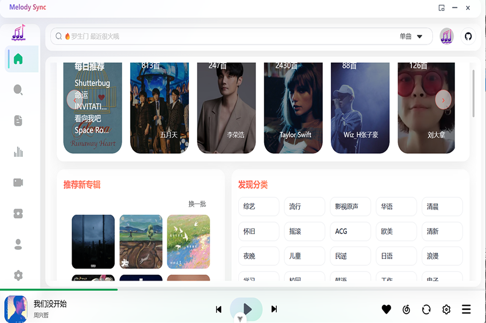
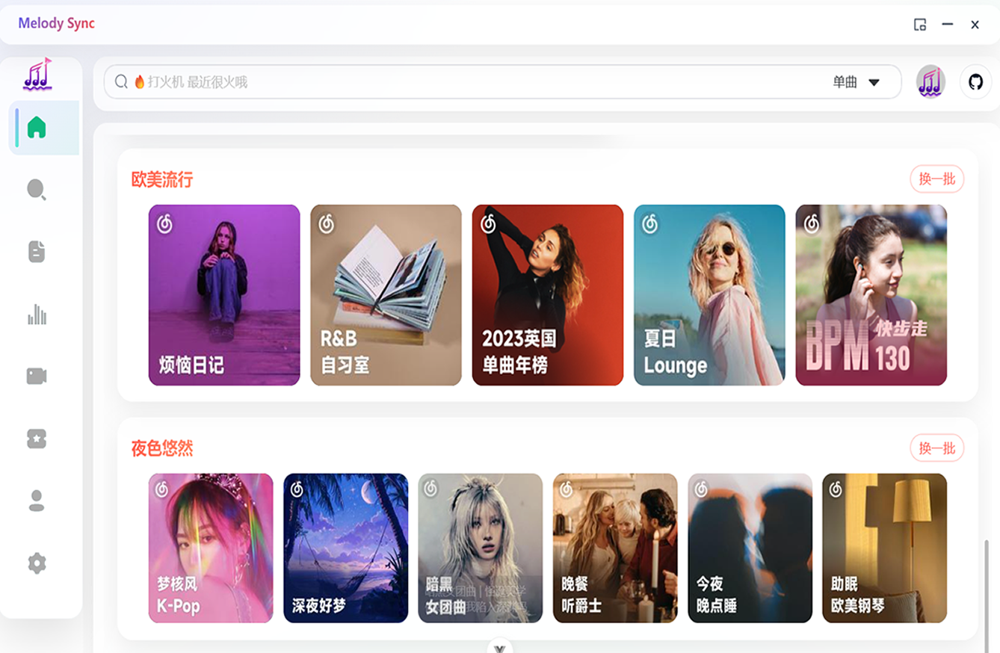
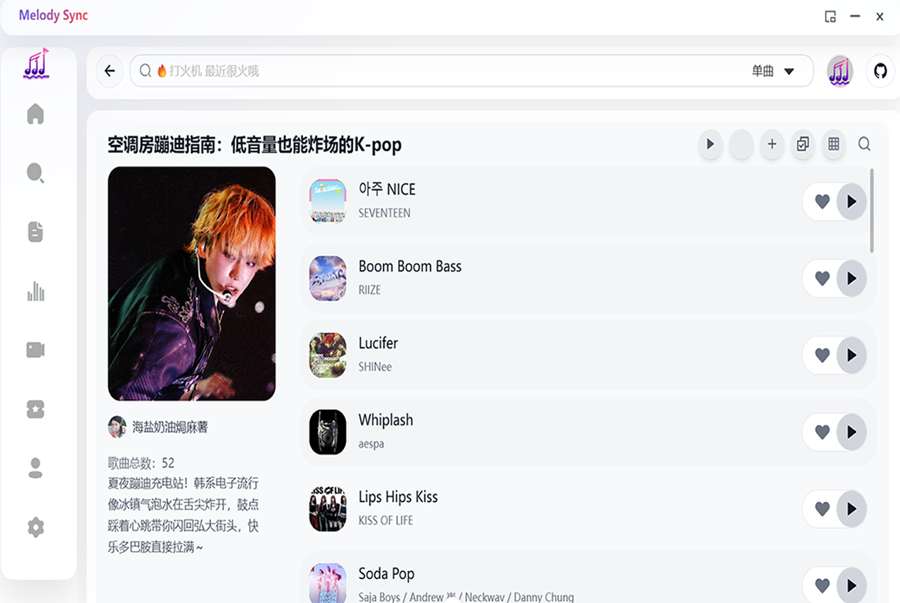
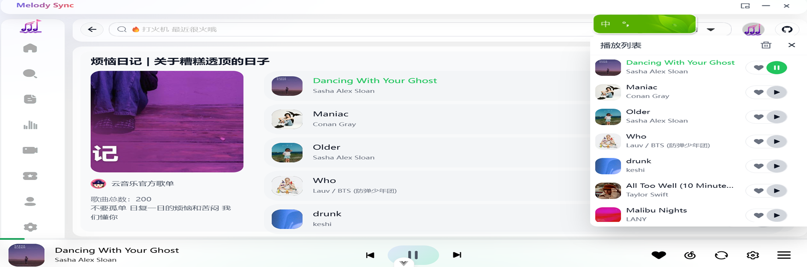
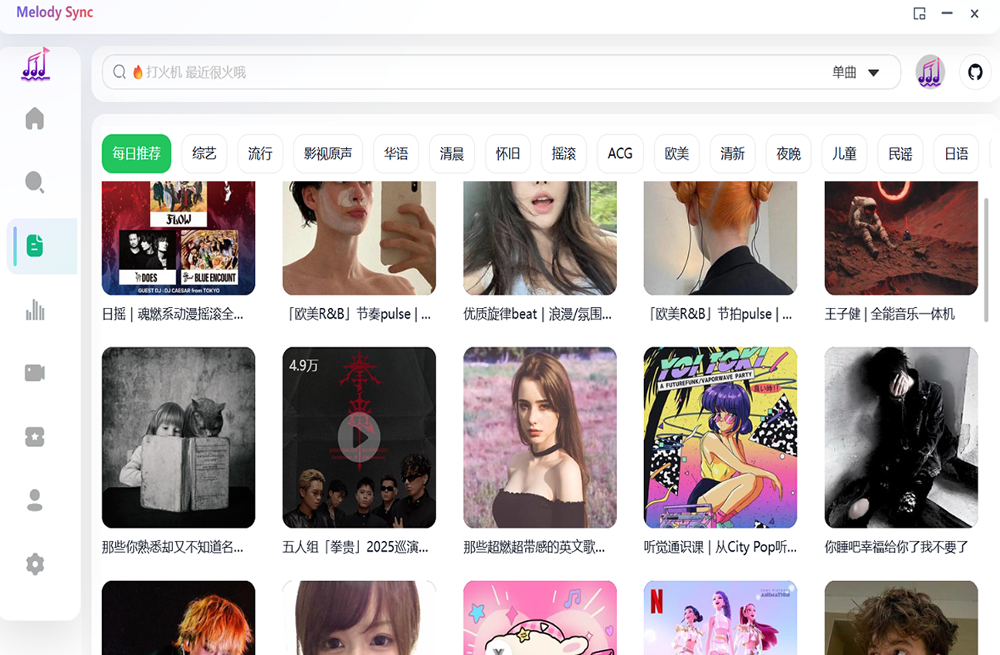
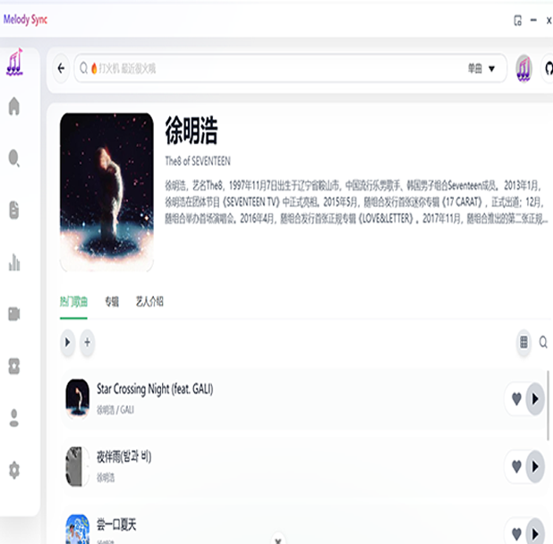

<h2 align="center">🎵 Melody Sync</h2>
<div align="center">

<!-- 文档入口：如需外链文档可在此处替换为你的地址 -->
[项目使用与常见问题](#环境配置)

主要功能如下

- 🎵 音乐推荐
- 🔐 网易云账号登录与同步
- 📝 功能
  - 播放历史记录
  - 歌曲收藏管理
  - 歌单 MV 排行榜 每日推荐
  - 自定义快捷键配置（全局或应用内）
- 🎨 界面与交互
  - 沉浸式歌词显示（点击左下角封面进入）
  - 独立桌面歌词窗口
  - 明暗主题切换
  - 迷你模式
  - 状态栏控制
  - 多语言支持
- 🎼 音乐功能
  - 支持歌单、MV、专辑等完整音乐服务
  - 音乐资源解析（基于 @unblockneteasemusic/server）
  - EQ均衡器
  - 定时播放 远程控制播放 倍速播放
  - 高品质音乐
  - 音乐文件下载
  - 搜索 MV 音乐 专辑 歌单 bilibili
  - 音乐单独选择音源解析
- 🚀 技术特性
  - 本地化服务，无需依赖在线API (基于 netease-cloud-music-api)
  - 全平台适配（Desktop & Web & Mobile Web & Android<测试> & ios<后续>）

## 项目简介

一个第三方音乐播放器、本地服务、桌面歌词、音乐下载、最高音质

## 预览地址

[https://melodysyncplayer.pages.dev/](https://melodysyncplayer.pages.dev/)

## 软件截图








## 项目启动

```bash
npm install
npm run dev
```

## 环境配置

为方便 Web 版本运行，需要为浏览器端提供可访问的后端 API（如 Render 上部署的 NeteaseCloudMusicApi）。同时支持自定义 GitHub 仓库信息。

1) 本地环境文件（被 git 忽略）

在项目根目录创建以下文件并填入你的配置：

```
.env.development.local
.env.production.local
```

示例（也可参考仓库中的 `env.sample`）：

```ini
# 更新检查与 GitHub Releases 链接所用仓库
VITE_GH_OWNER=toot66
VITE_GH_REPO=MelodySyncPlayer

# 可选：GitHub Token（提高 API 速率限制）
# VITE_GITHUB_TOKEN=ghp_xxx

# 仅网页模式需要：音乐后端 API（NeteaseCloudMusicApi 或兼容实现）
# 本地开发可指向本机或你的云端服务
# VITE_API=http://127.0.0.1:3000

# 云端部署（Cloudflare Pages）请在控制台设置环境变量：
#   Name: VITE_API
#   Value: https://neteasemusic-api.onrender.com   ← 你的后端域名
# 同时确认：
#   Build command: npm run build
#   Output directory: out/renderer
```

2) 自动发布到 GitHub（可选）

如果使用 electron-builder 自动发布到 GitHub Releases，请在打包环境设置：

```
GH_TOKEN=你的GitHubToken(需具备 repo 权限)
```

随后执行打包/发布脚本（例如）：

```
npm run build:win
```

> 说明：应用会优先从 GitHub Releases 的 assets 列表中匹配下载文件，找不到时才按命名模板回退。

## 开发文档

点击这里[开发文档](./DEV.md)

## 赞赏☕️

| 微信赞赏 | 支付宝赞赏 |
| :------: | :--------: |
|  |  |

## 项目统计

[](https://starchart.cc/toot66/MelodySyncPlayer)


## 欢迎提Issues

## 声明

本软件仅用于学习交流，禁止用于商业用途，否则后果自负。
希望大家还是要多多支持官方正版，此软件仅用作开发教学。
